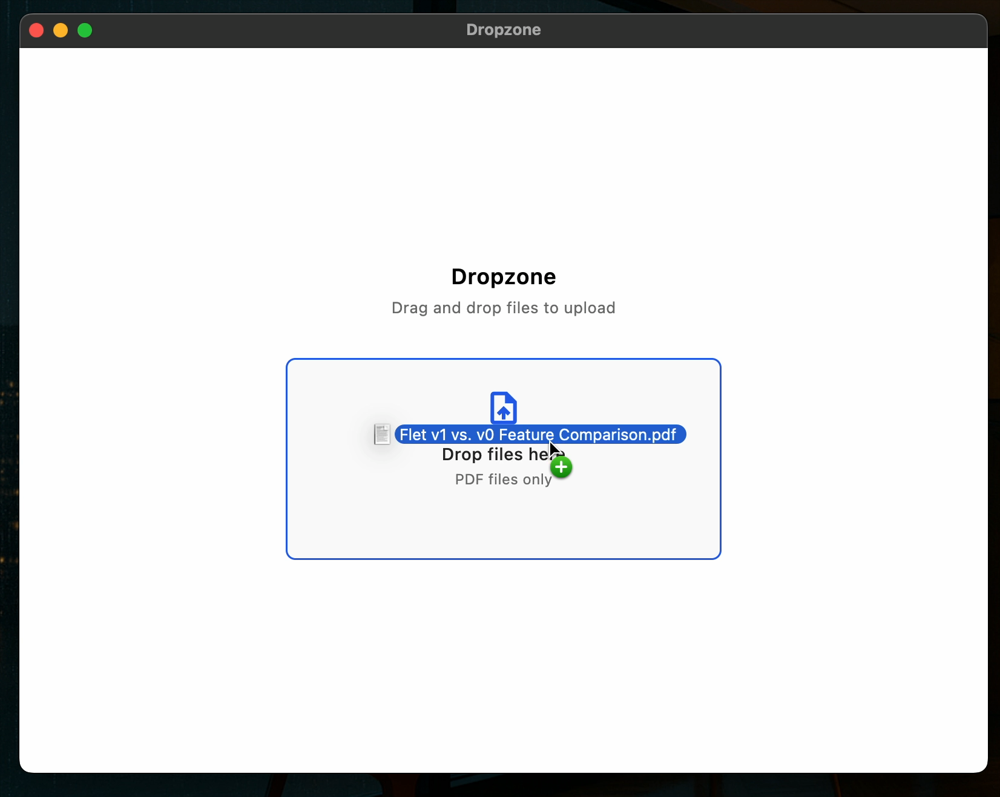

# flet-desktop-drop
Desktop drop control for Flet v1 (0.80.0 or later)



## Installation

Add dependency to `pyproject.toml` of your Flet app:

* **Git dependency**

Link to git repository:

```
dependencies = [
  "flet-desktop-drop @ git+https://github.com/Bbalduzz/flet-desktop-drop",
  "flet>=0.80.1",
]
```

Build your app on your machine:
```
flet build macos -v
```

## Documentation

[Link to documentation](https://Bbalduzz.github.io/flet-desktop-drop/)
